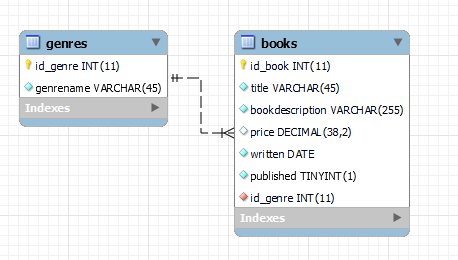
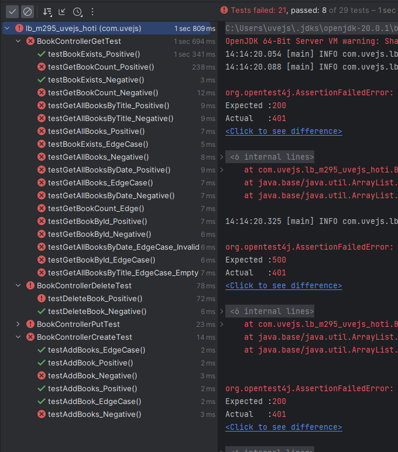

# LB M295 Uvejs Hoti
Das ist die Projektarbeit vom Modul 295.
In diesem Projekt geht es um die Erstellung der CRUD-Backendschnittstellen/HTTP-Methoden.

## Visuals

## Validierungsregeln

| Attribut          | Regel                                                                                          | Annotation                    |
|-------------------|------------------------------------------------------------------------------------------------|-------------------------------|
| bookDescription   | Die Beschreibung muss zwischen 2 und 255 Zeichen lang sein                                    | @Size(min = 2, max = 255)    |
| title             | Der Titel darf nur aus Buchstaben und Zahlen bestehen                                           | @Pattern(regexp = "^[a-zA-Z0-9]*$") |
| price             | Der Preis muss größer oder gleich 0.01 sein                                                     | @DecimalMin(value = "0.01")   |

## Berechtigungsmatrix

| Rolle          | Beschreibung                                                                                               | GET   | POST  | PUT   | DELETE |
|----------------|------------------------------------------------------------------------------------------------------------|-------|-------|-------|--------|
| Benutzer       | Standardbenutzer mit Lesezugriff auf Bücher und Genres                                                      | Ja    | Ja    | Nein  | Nein   |
| Administrator | Verwalter mit Zugriff auf alle CRUD-Operationen für Bücher und Genres                                      | Ja    | Ja    | Ja    | Ja     |

## OpenAPI Dokumentation der Services (Resourcen)

-
## Autor
Uvejs Hoti

## Zusammenfassung
Diese Projektarbeit ist mir nicht gelungen, so wie ich es mir erhofft habe. Aus zeitlichen
Gründen konnte bin ich nicht fertig geworden und konnte nicht alle Anforderungen erfüllen.
Beispielsweise hat mir die Security grosse Probleme bereitet. Hier war ich mir nicht ganz sicher,
ob ich sie streichen sollte, denn die Testfälle sind davon abhängig. Während des Projektes hatte
ich immer den selben Fehler - ein 500 Internal-Server-Error, den ich bis zum Schluss nicht beheben konnte.
Das Lustige daran war, dass es etwa bei jedem dritten Mal funktionierte und sonst nicht. So habe ich viel
Zeit verloren, die ich in Besseres genutzt hätte.

Ich nehme mit, dass ich in Zukunft meine Zeit besser einteilen muss. Bei Problem wie dieses, wo ich viel
Zeit verloren habe, hätte ich mir früher Hilfe beim Coach holen müssen. Jedoch wollte ich auch selbstständig am
gesamten Projekt arbeiten, als ein Fehler aufgetaucht ist. Das ist mir meiner Meinung nach gut gelungen.

Dennoch hat es mir Spass gemacht, so ein Projekt alleine zu dürfen.